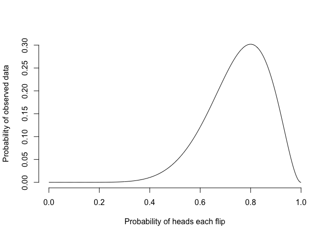
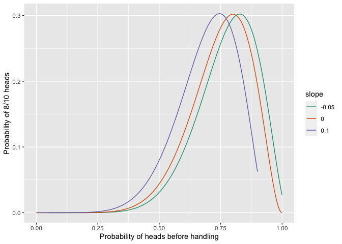
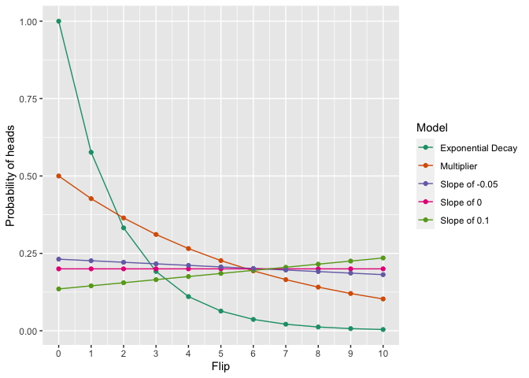

<!-- README.md is generated from README.Rmd. Please edit that file -->

# flipped

The goal of flipped is to explore models for coin flippings beyond the
standard binomial.

-   Website: <https://bomeara.github.io/flipped/>
-   Source: <https://github.com/bomeara/flipped/>

## Installation

You can install the development version of this package from
[GitHub](https://github.com/) with:

``` r
# install.packages("devtools")
devtools::install_github("bomeara/flipped")
```

## Example

Imagine we get 8 heads out of 10 coin flips. In standard stats, we’d do
something like this:

``` r
library(flipped)
nflips <- 10
nheads <- 8
probability_heads <- seq(from=0, to=1, length.out=1000)
probability_data <- dbinom(nheads, nflips, probability_heads)
```

The probability of the data given different probabilities of heads under
the standard binomial model is:

``` r
plot(probability_heads, probability_data, xlab="Probability of heads each flip", ylab="Probability of observed data", type="l", bty="n")
```



The best estimate from this is 0.8, and the likelihood of the data given
this is 0.3. However, this model makes a strong assumption – the
probability of heads is constant across flips. But coins are real
objects, which can be bent, get dirty, lose metal, and more in the
keyboard-roughened hands of a statistician. It’s not unreasonable to
think that the act of handling and flipping a coin changes the
probability of heads. We can make models that can do this.

One set of models could have a linear slope: every time a coin is
handled, its probability of heads can increase or decrease by a set
amount: 0.50, 0.51, 0.52. The parameters of such a model would be the
starting probability of heads before a coin was handled and the slope of
the change. The standard binomial model then becomes a special case of
this model with slope arbitrarily set to zero. We could think of ways to
restrict this to other models: a 0.010 increase per flip from a starting
value, a 0.005 loss from a starting value, and so forth. The probability
of heads for such models, where the probability of heads before handling
is 0.50, would be:

We can calculate the likelihoood of the observed data of 8 heads from 10
flips for all these models, changing the probability of heads for a coin
before it is handled:

``` r
nheads <- 8
flat <- profile_linear_model(nheads, nflips, slope=0.0)
increasing <- profile_linear_model(nheads, nflips, slope=0.10)
decreasing <- profile_linear_model(nheads, nflips, slope=-0.05)
all_results <- rbind(flat, increasing, decreasing)
all_results$slope <- as.factor(c(rep(0, nrow(flat)), rep(0.10, nrow(increasing)), rep(-0.05, nrow(decreasing))))
print(ggplot(all_results, aes(x=preflip_prob, y=likelihood, colour=slope, group=slope)) + geom_line() + ylab("Probability of 8/10 heads") + xlab("Probability of heads before handling") + scale_colour_brewer(palette = "Dark2") )
```



They have different optimal parameter values, but the same likelihood:

``` r
print(round(flat[which.max(flat$likelihood),],2))
#>     preflip_prob likelihood
#> 800          0.8        0.3
print(round(increasing[which.max(increasing$likelihood),],2))
#>     preflip_prob likelihood
#> 746         0.75        0.3
print(round(decreasing[which.max(decreasing$likelihood),],2))
#>     preflip_prob likelihood
#> 828         0.83        0.3
```

This shows that these three models cannot be distinguished with
likelihood – they’re congruent. So we can’t tell, with simple coin
flipping, from just the final tally of heads and tails whether the
probability of heads was increasing or decreasing with flips.

We can do this with multiple kinds of models, too: all these have the
same probability of the data within a pre-set numerical precision:

``` r
nheads=2
nflips=10
congruent <- find_congruent_models(nheads=nheads, nflips=nflips)
#> [1] "Optimizing multiplicative model"
#> [1] "Got within 2.2260848755451e-06 of the target"
#> [1] "Optimizing exponential decay model"
#> [1] "Got within 6.33013396881821e-05 of the target"
#> [1] "Optimizing slope 0 model"
#> [1] "Got within 2.22044604925031e-16 of the target"
#> [1] "Optimizing slope 0.1 model"
#> [1] "Got within 8.74494624170108e-06 of the target"
#> [1] "Optimizing slope -0.05 model"
#> [1] "Got within 7.87077862062779e-05 of the target"
print(ggplot(congruent$probabilities_per_flip, aes(x=Flips, y=Probability_of_heads_this_flip, colour=Model, group=Model)) + geom_line() + geom_point() + ylab("Probability of heads") + scale_x_continuous(name="Flip", breaks=seq(from=0, to=nflips, by=1)) + 
scale_colour_brewer(palette = "Dark2") )
```


